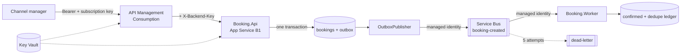

# Azure APIM secure gateway + queue-based messaging

A .NET 8 booking API behind Azure API Management, with asynchronous processing
over Service Bus, a transactional outbox joining the two, managed identity
everywhere, and PowerShell automation for the whole deployment.

**This is a portfolio project, not a production system.** The code is real,
tested and runnable — `dotnet test` is green with 29 tests and no Azure account
needed — but SQLite stands in for SQL Server and nothing here has been deployed to
a live subscription. See [Honest status](#honest-status).

---

## Why it exists

The interesting problem in a booking API is not accepting a POST. It is that
accepting a booking and *doing something about it* have to be atomic without being
synchronous. Publish inside the request and you can send a message for a booking
that rolled back; publish after committing and you can save a booking whose
message was never sent.

The answer is a transactional outbox, and the honest consequence is
at-least-once delivery — which is why the worker deduplicates. The two halves are
one design.

## Architecture



Full diagrams, the outbox guarantee spelled out, and the three layers of duplicate
protection: [docs/architecture.md](docs/architecture.md).
Policy order and why it is that order: [docs/apim-request-flow.md](docs/apim-request-flow.md).

## Repository layout

```
src/Booking.Api/           .NET 8 minimal API: create, retrieve, health, outbox publisher
src/Booking.Worker/        Worker service: consumes the queue, idempotent, dead-letters poison
src/Booking.Contracts/     The message contract and validation both sides share
tests/                     29 xUnit tests - integration for the API, handler tests for the worker
infra/                     Bicep at subscription scope; modules per service
apim/policies/             API and operation policy XML
apim/products/             Starter and Premium products with their SLA policies
apim/openapi/              The OpenAPI 3.0 contract imported into APIM
scripts/                   Deploy-Infrastructure.ps1 · Import-ApimApi.ps1 · Invoke-SmokeTests.ps1 · reconcile_bookings.py
docs/                      architecture · APIM flow · Entra ID · cost · setup · troubleshooting
```

## How to run

Locally, with no Azure account. The API falls back to an in-memory publisher when
no Service Bus namespace is configured, so the outbox, idempotency and validation
paths all work from a clone.

```bash
dotnet test BookingPlatform.sln          # 29 tests
dotnet run --project src/Booking.Api      # http://localhost:5080

curl -s -X POST http://localhost:5080/bookings \
  -H 'Content-Type: application/json' \
  -H "Idempotency-Key: $(uuidgen)" \
  -d '{"propertyId":"PROP-1001","guestEmail":"guest@example.com",
       "checkIn":"2026-11-01","checkOut":"2026-11-05","guests":2,
       "totalAmount":592.40,"currency":"EUR"}' | jq

curl -s http://localhost:5080/health/ready | jq   # outbox depth
```

Send the same `Idempotency-Key` twice: the second call returns `200` with
`Idempotency-Replayed: true` and the original booking, not a new one.

In Azure — full walkthrough in [docs/setup.md](docs/setup.md):

```powershell
Copy-Item infra/main.parameters.example.json infra/main.parameters.json   # then edit
./scripts/Deploy-Infrastructure.ps1 -ParameterFile ../infra/main.parameters.json
./scripts/Import-ApimApi.ps1 -ResourceGroupName rg-<prefix>-dev -ApimName apim-<prefix>-dev-<suffix>
./scripts/Invoke-SmokeTests.ps1 -GatewayUrl https://<apim>.azure-api.net/booking/v1
```

Roughly **$13/month** at the defaults, essentially all of it the App Service plan.
[docs/cost.md](docs/cost.md) has the breakdown and the one expensive trap
(APIM Developer at ~$50/month whether or not anyone calls it).

## How to test

| Layer | Command | What it covers |
|---|---|---|
| Unit + integration | `dotnet test` | 19 API tests through `WebApplicationFactory` against the real endpoints, 10 worker handler tests. No mocks of our own code, no Azure |
| Infrastructure | `bicep build infra/main.bicep` | Compiles with no warnings |
| Policies | `./scripts/Import-ApimApi.ps1` | Every policy is parsed locally before anything is uploaded |
| Live gateway | `./scripts/Invoke-SmokeTests.ps1` | Auth rejection, creation, idempotency replay, URL rewrite, eventual confirmation, rate limit with `Retry-After` |
| Drift | `python scripts/reconcile_bookings.py` | The API's bookings against the worker's confirmations, field by field |

The tests worth reading are the ones about duplicates:

- `Concurrent_deliveries_of_the_same_message_produce_exactly_one_write` fires
  eight simultaneous deliveries at the handler and asserts one write and seven
  duplicates — the check-then-act race that an `AlreadyProcessed` call followed by
  an insert would lose.
- `Replaying_an_idempotency_key_returns_the_original_booking` asserts `200` and
  the *same* `createdAt`, not merely the same id.
- `A_message_that_sat_in_the_queue_past_its_check_in_date_is_still_processed` —
  the API rejects past dates, the worker must not, or a weekend-long outage turns
  every queued booking into a dead letter.

CI runs all of it on every push, plus a secret-hygiene job that fails the build if
a connection string, a local configuration file, or a hard-coded tenant or client
id is ever committed: [.github/workflows/build.yml](.github/workflows/build.yml).

## What this demonstrates

| Skill | Where to look |
|---|---|
| **API gateway policies** | [`apim/policies/api-policy.xml`](apim/policies/api-policy.xml) — `validate-jwt` against Entra ID, `rate-limit-by-key` and `quota-by-key` per subscription, `ip-filter`, `set-header`, and an RFC 7807 `on-error` so gateway errors look like API errors. Order and reasoning in [docs/apim-request-flow.md](docs/apim-request-flow.md#policy-order-and-why) |
| **Caching, header and URL rewrite** | [`apim/policies/operations/`](apim/policies/operations/) — a 30-second response cache varying by subscription, and a `rewrite-uri` decoupling the partner's vocabulary from the backend route |
| **Products, subscriptions, revisions** | [`apim/products/`](apim/products/) — Starter and Premium with distinct limits and approval flows; `Import-ApimApi.ps1` imports to a revision and only promotes with `-MakeCurrent`. The version-vs-revision rule is in [docs/apim-request-flow.md](docs/apim-request-flow.md#versions-and-revisions) |
| **Queue-based integration** | [`OutboxPublisher`](src/Booking.Api/Messaging/OutboxPublisher.cs) and [`ServiceBusConsumer`](src/Booking.Worker/Messaging/ServiceBusConsumer.cs) — peek-lock with autocomplete off, explicit complete/abandon/dead-letter, and `maxDeliveryCount: 5` as the backstop |
| **Outbox pattern** | [`BookingStore.TryCreate`](src/Booking.Api/Storage/BookingStore.cs) — booking and message in one transaction, with the at-least-once consequence documented rather than glossed over |
| **Idempotency** | Three layers: the client's `Idempotency-Key`, optional broker duplicate detection, and the worker's ledger using `INSERT ... ON CONFLICT DO NOTHING` inside the booking transaction |
| **Secret management** | Service Bus with `disableLocalAuth: true`, so no SAS key exists. Managed identities scoped to the queue, not the namespace. One secret in Key Vault, read by APIM as an unversioned named value and by the App Service as a Key Vault reference |
| **Infrastructure as code** | [`infra/`](infra/) — Bicep at subscription scope, parameterised, no hard-coded names, compiling clean |
| **PowerShell automation** | [`scripts/`](scripts/) — deployment with CSPRNG secret generation and `-WhatIf`, policy import with local validation, and smoke tests taking every credential as a `SecureString` |
| **Python automation** | [`scripts/reconcile_bookings.py`](scripts/reconcile_bookings.py) — reconciles both stores, comparing money as `Decimal` so `592.4` and `592.40` are not reported as drift |
| **Technical documentation** | Six documents under `docs/`, including a cost breakdown and a troubleshooting log separating what actually happened from what is guarded against |

> MuleSoft, DataWeave and API-led connectivity are demonstrated in the sibling
> repository, `mulesoft-api-led-property-integration`.

## Honest status

**Verified by running it:**

- `dotnet test` — 29 tests pass (19 API, 10 worker), Release configuration.
- `bicep build infra/main.bicep` — compiles, no warnings.
- All three PowerShell scripts parse cleanly.
- Every APIM policy and the OpenAPI document are well-formed and internally
  consistent; CI asserts each operation policy file matches an `operationId`.
- The API was run locally: three bookings created, the outbox observed draining to
  zero, and the bookings moving from `PENDING` to `CONFIRMED`.
- `reconcile_bookings.py` was run against a seeded worker store in both
  directions — correctly reporting a missing confirmation, an orphan, an amount
  mismatch and a dead letter (exit 1), and correctly reporting agreement (exit 0).

**Not verified:**

- **Nothing has been deployed to Azure.** No subscription deployment has run, no
  APIM instance exists, and no policy has been applied to a live gateway. Expect
  to fix something on the first real deployment.
- The Entra ID registrations are documented, not created.

**Deliberately simplified:**

- SQLite instead of SQL Server, and one connection with serialised writes.
- The worker's compute is not provisioned — see
  [docs/setup.md](docs/setup.md#where-the-worker-runs) for why, and for the three
  options with their trade-offs.

## What I would change for production

1. **SQL Server instead of SQLite, everywhere.** This is the first change and the
   one that unblocks the rest. SQLite here is per-instance, so two API instances
   have two outboxes and two workers have two deduplication ledgers — meaning
   deduplication is only local. Azure SQL with EF Core, and the outbox drained
   with `SELECT ... WITH (UPDLOCK, READPAST)` so multiple publishers can share it.
2. **Certificates, not client secrets.** Or workload identity federation. A secret
   in a partner's configuration is a secret that eventually appears in a support
   ticket.
3. **Dead-letter processing.** Right now a dead-lettered message sits until
   someone looks. It needs an alert on `DeadLetterMessageCount`, a replay tool,
   and a documented triage owner.
4. **Outbox cleanup.** Published rows are never deleted, so the table grows
   forever. A retention job keeping perhaps 30 days, with the rest archived.
5. **Real observability.** `deployMonitoring` is opt-in and off; in production it
   is mandatory, with alerts on outbox depth, dead-letter count, 429 rate per
   subscription, and end-to-end booking latency. The last is the business metric.
6. **Zero-downtime deployment.** Deployment slots with a warm-up on `/health/ready`,
   and the API and worker deployed independently so the message contract's
   forward compatibility is actually exercised.
7. **A message schema registry.** `BookingCreated.Version` is checked and
   unsupported versions are dead-lettered, which is right, but the contract should
   be published somewhere the worker's team can see it change.
8. **Private endpoints.** Service Bus and Key Vault are currently reachable from
   the internet, protected by RBAC alone. Private endpoints plus a VNet-integrated
   App Service remove that exposure entirely — which needs APIM Developer or above.

## Related

- Sibling repository: **`mulesoft-api-led-property-integration`** — the same
  property-booking domain implemented as a three-layer MuleSoft API-led
  integration with DataWeave, MUnit and Anypoint API Manager policies.

## License

MIT — see [LICENSE](LICENSE).
