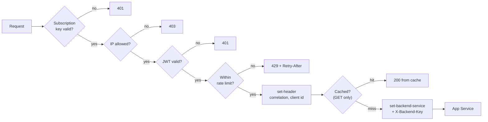

# Request flow through API Management

## Policy order, and why



Each stage is cheaper than the one after it, so the cheapest possible rejection
happens first:

| # | Stage | Cost of rejecting here | Why not later |
|---|---|---|---|
| 0 | Subscription key | Effectively free; APIM checks it before any policy runs | Nothing else should be spent on an unsubscribed caller |
| 1 | `ip-filter` | A string comparison | No point verifying a signature for an address that is not allowed |
| 2 | `validate-jwt` | An RSA verification plus a cached JWKS lookup | The most expensive check, so it goes after the free ones |
| 3 | `rate-limit-by-key` | A counter read | Needs the identity established above to pick the right bucket |
| 4 | `set-header` | Negligible | Only worth doing for a request that will actually be served |
| 5 | `cache-lookup` | A cache read | Placed after authorisation so a cache hit is never served to someone unauthorised |

Reordering 2 and 3 is the mistake worth naming: rate-limiting before
authenticating means an attacker with no token can consume a legitimate partner's
quota.

## The policy files

| File | Scope | What it does |
|---|---|---|
| `apim/policies/api-policy.xml` | API | Everything above, plus the outbound security headers and the RFC 7807 error shape |
| `apim/policies/operations/getBooking.xml` | Operation | 30-second response cache, varying by subscription |
| `apim/policies/operations/getReservation.xml` | Operation | `rewrite-uri` mapping the partner's vocabulary onto the backend route |
| `apim/products/starter-policy.xml` | Product | 20 requests/minute, 5,000/day |
| `apim/products/premium-policy.xml` | Product | 600/minute with a 40-per-5-second burst, 500,000/day |

Product policies run before API policies, which is why tier limits belong there:
the API-level `rate-limit-by-key` is the ceiling nobody exceeds, and each product
tightens it.

## Two tier limitations worth knowing before you demo this

**The Consumption tier has no built-in cache.** `caching-type="internal"` is
silently a no-op there - no error, no warning, just no caching. The policy in this
repo uses `prefer-external`, so it works when an Azure Cache for Redis is attached
and does nothing harmful when one is not. On Developer, Basic, Standard or Premium
the internal cache works with no extra resource. See [cost.md](cost.md) for the
price of the smallest usable Redis.

**Service Bus Basic has no duplicate detection.** That is a Standard-tier feature.
The worker's deduplication ledger works regardless, which is why the design does
not depend on the broker for it.

## Versions and revisions

Routinely confused, and the distinction decides whether partners have to do work:

- A **revision** is a non-breaking change to the same version: a new optional
  query parameter, an added response field, a policy adjustment. It is created,
  tested, and then made current. Contracts, subscription keys and policies carry
  over untouched. `Import-ApimApi.ps1` imports to a revision by default and only
  promotes it with `-MakeCurrent`.
- A **version** is a breaking change: `v1` → `v2`. Both run at once, on different
  paths, and partners migrate on their own schedule.

The rule used here: if an existing client's request would stop working, or an
existing response field changes meaning, it is a version. Everything else is a
revision.

```powershell
# Import as a revision and leave it for inspection
./scripts/Import-ApimApi.ps1 -ResourceGroupName rg-booking-dev -ApimName apim-booking-dev-a1b2c3

# Promote once it has been tested
./scripts/Import-ApimApi.ps1 -ResourceGroupName rg-booking-dev -ApimName apim-booking-dev-a1b2c3 -MakeCurrent
```

## Products and subscriptions

A partner requests access to a product from the developer portal. Approval creates
a **subscription**, which mints the key pair the gateway checks. Revoking access
is deleting the subscription: no redeploy, no code change, effective immediately.

| | Starter | Premium |
|---|---|---|
| Rate limit | 20/minute | 600/minute, 40 per 5 seconds |
| Daily quota | 5,000 | 500,000 |
| Approval | Automatic | Manual |
| Subscription limit | 100 | 25 |

Both are created by `infra/modules/apim.bicep`; their policies and the descriptions
partners read live in `apim/products/`.

## Developer portal

Not available on the Consumption tier - that is a real constraint, not an
oversight. On Developer or above:

1. **APIM → Developer portal → Portal overview → Developer portal**, then publish.
2. Add the Booking API to both products so it appears in the catalogue.
3. Configure **Identities** so partners can sign up, or restrict to Entra ID.
4. Add pages for getting started, the error contract, and the rate limits.

Screenshot placeholders live in `images/`:

| File | What it should show |
|---|---|
| `images/apim-policies.png` | The API's inbound policy in the editor |
| `images/apim-products.png` | Starter and Premium with their subscription counts |
| `images/apim-429.png` | A 429 with `Retry-After` and `X-RateLimit-Remaining` |
| `images/developer-portal.png` | The published portal |

## Verifying it works

`scripts/Invoke-SmokeTests.ps1` asserts all of this against a live gateway:

```powershell
./scripts/Invoke-SmokeTests.ps1 `
    -GatewayUrl https://apim-booking-dev-a1b2c3.azure-api.net/booking/v1 `
    -TenantId $tenantId -ClientId $clientId -Scope "api://$apiAppId/.default"
```

It checks that an unauthenticated call is rejected, that a valid call creates a
booking, that replaying an `Idempotency-Key` returns the original, that the
rewritten `/reservations` path reaches the same booking, that the booking
eventually becomes `CONFIRMED`, and that the rate limit produces a `429` with
`Retry-After`. Exit code is non-zero on any failure, so it can gate a release.
