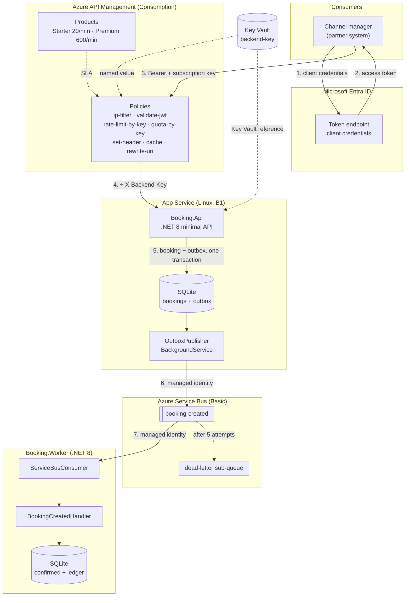
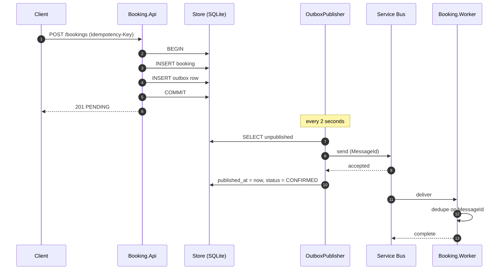
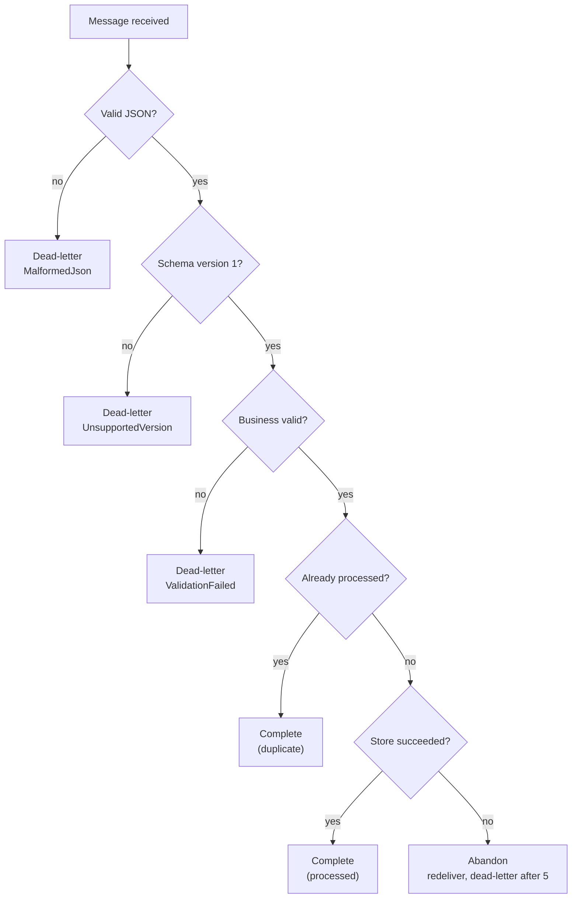
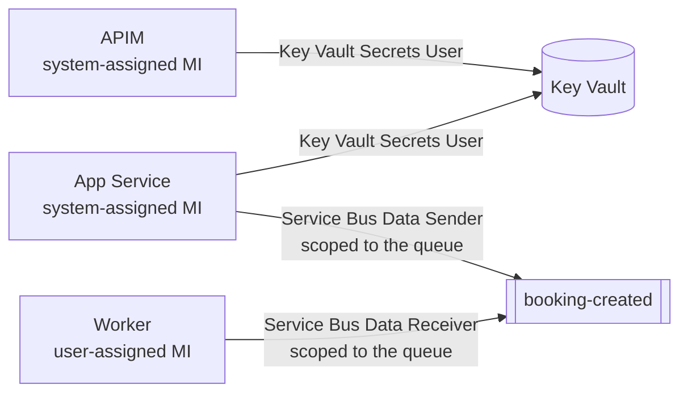

# Architecture

## The system

## Why it is shaped this way

**The gateway owns security; the app owns behaviour.** There is no authentication
code in `Booking.Api` at all. Token validation, subscription enforcement, rate
limiting and IP filtering are policies, so they are configured in one place,
audited in one place, and changed without a redeploy. The app's only concession is
the `X-Backend-Key` check, which exists purely to reject traffic that bypassed the
gateway.

**Accepting is synchronous; confirming is not.** `POST /bookings` returns as soon
as the booking is durable. Everything after that - notifications, inventory,
whatever a real system would do - happens off a queue. A slow downstream must
never slow down taking the booking.

**The outbox is the join between them.** The booking row and its message commit in
one transaction, so there is no window in which one exists without the other. That
is the whole reason it exists, and it is worth being precise about the guarantee:

Steps 8 and 10 are not atomic. If the process dies between them, the message was
sent and the row still looks unpublished, so it is sent again. **The outbox
guarantees at-least-once, never exactly-once.** The worker's deduplication ledger
is the other half of that design, not a belt-and-braces extra.

## Where duplicates are stopped

Three layers, each catching a different duplicate:

| Layer | Catches | Mechanism |
|---|---|---|
| `Idempotency-Key` on `POST` | A client retrying after a timeout | Unique index on `bookings.idempotency_key`; the original booking is returned with `200` |
| Service Bus duplicate detection | The same `MessageId` sent twice inside the window | **Standard tier only.** Not available on Basic, which is what this repo deploys by default |
| The worker's ledger | Everything else - redelivery, an outbox re-send, concurrent consumers | `INSERT ... ON CONFLICT DO NOTHING` in the same transaction as the booking write |

The third is the one that always applies, which is why it is a durable table
rather than an in-process cache, and why
`Concurrent_deliveries_of_the_same_message_produce_exactly_one_write` fires eight
concurrent deliveries at it in the test suite.

## What happens when a message cannot be processed

The distinction that matters is between *will never succeed* and *failed this
time*. Retrying poison forever is how a queue backs up; dead-lettering a transient
failure is how a booking gets lost. `BookingCreatedHandler` returns one of four
outcomes and `ServiceBusConsumer` does nothing but act on them - which is what
makes every branch above testable without a broker.

## Identity and secrets

Service Bus has `disableLocalAuth: true`, so SAS keys do not exist to be leaked.
Role assignments are scoped to the queue rather than the namespace, so a queue
added later grants nothing by inheritance. The single secret in the system is the
backend key, and it exists only because APIM has to inject it as a header value -
there is no identity-based equivalent for that.

## Correlation

One id spans the whole path: APIM sets `X-Correlation-ID` if the caller did not,
the API stores it on the booking and copies it onto the outbox row, the publisher
sets it as the Service Bus `CorrelationId`, and the worker writes it onto the
confirmed booking. `reconcile_bookings.py` compares it on both sides, so a
mismatch is reported rather than discovered during an incident.
